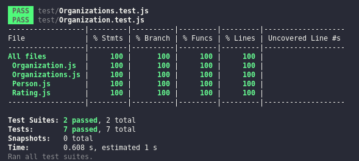

<h1 align="center">
     
    
LGBTQIAP+ Friends {reprograma}

</h1>

  

## 1. Qual o problema? 

 

De acordo com a pesquisa Demitindo Preconceitos, 53% das pessoas LGBTQIA+ não assumem sua orientação sexual ou identidade de gênero no trabalho. Entre os principais motivos estão medo de discriminação, demissão ou dúvida sobre a capacidade profissional.

Ainda segundo a pesquisa, 47% dos entrevistados assumem abertamente serem LGBTQIAP+ no trabalho, mas, também, 40% já sofreram discriminação por orientação sexual. As principais situações relatadas foram:

- Piadas sem consentimento por gestores e colegas
- Colegas evitando contato
- Fofocas
- Assédio moral
- Exposição por colegas seguida de pedidos de demissão
    
[Laços Corporativos](https://www.lacoscorporativos.com.br/voce-sabe-o-que-e-uma-empresa-gay-friendly/)
    
     

    
## 2. O que propõe o projeto <strong>LGBTQIAP+ Friends</strong>?     
    

O LGBTQIAP+ Friends possibilita o ranqueamento de organizações públicas e privadas medindo sua receptividade à comunidade LGBTQIAP+.

As empresas melhores ranqueadas são aquelas que apostam no potencial intelectual e profissional, oferecendo oportunidades e representatividade por meio de políticas afirmativas de igualdade e inclusão.

A solução é baseada na crença de que a contratação e motivação desses colaboradores é essencial para propiciar um ambiente de trabalho inclusivo, seguro e diverso.
 
 
  
 ## 3. Como vai funcionar? 

<strong>LGBTQIAP+ Friends</strong> é um aplicativo para avaliação e divulgação das organizações com foco na comunidade LGBTQIAP+, fornecendo um retrato mais transparente, uma vez que abre espaço para que os usuários compartilhem suas experiências, refletindo a realidade da empresa.

Após um cadastro simples, no qual são fornecidas algumas informações pessoais, pode-se avaliar as diversas organizações cadastradas na plataforma.

 

## 4. Tecnologias utilizadas:
| Ferramenta | Descrição |
| --- | --- |
| `javascript` | Linguagem de programação. |
| `nodejs` | Runtime de JavaScript baseado no motor V8 JavaScript do Chrome.| 
| `npm ou yarn` | Gerenciador de pacotes.|
| `jest` | Framework de testes em JavaScript.|

 
 

## 5 - Regras de negócio 
- A avaliação só pode ser feita por um usuário cadastrado.
- O usuário pode avaliar a empresa entre 1 e 5 pontos.
- Uma organização só adquire o selo LGBTQIAP+ friendly se tiver pontuação superior a 4 pontos, mediante avaliações realizadas.

    
 
 
    
## 6 - Implementações Futuras

- Implementação de um canal de denúncias
- Divulgação de vagas destinadas exclusivamente para pessoas LGBTQIAP+.
- Fórum para interação entre os usuários.
    
 
 
    
## 7 - Cobertura de testes
Para verificar a cobertura de testes, execute: **$npm run coverage**

  

    
 
 

## 8. Para rodar
    
1. Faça o download ou clone este repositório;
2. Rode: **$ npm install**;
3. Para executar:  **$ npm run start**.
 
 
 
      

  

 
    
## 9. Autora 👩‍💻    
     
  ### Renata Igarashi
- [Linkedin](https://www.linkedin.com/in/renata-igarashi/)
- [Github](https://github.com/renataigarashi)